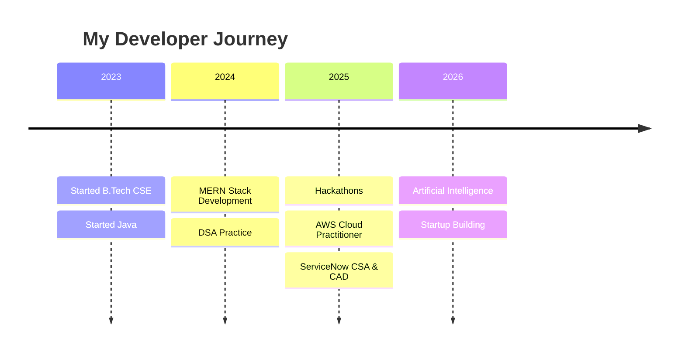

<div align="center">


[](https://git.io/typing-svg)


</div>

---


# 👨‍💻 About Me

🎓 B.Tech CSE @ Mohan Babu University (CGPA: **9.81**)

🏆 Hackathon Winner

🔥 Solved **250+ LeetCode Problems**

☁ AWS Cloud Practitioner Certified

⚡ ServiceNow CSA & CAD Certified

🤖 AI Enthusiast

🚀 MERN Stack Developer

💡 Building AI Agents and Startup Projects

🎯 Goal: Crack Top Product Companies

---

# 🚀 Tech Stack

### Languages

<p>

</p>

### Frontend

<p>

</p>

### Backend & Database

<p>

</p>

### Cloud & Tools

<p>

</p>

---

# 🏆 Achievements

✅ 250+ LeetCode Problems

✅ 5⭐ Java on HackerRank

✅ 4⭐ SQL on HackerRank

✅ NHETIS 2025 – 3rd Prize

✅ SAMARTHA National-Level Hackathon Finalist

✅ AWS Cloud Practitioner Certified

✅ ServiceNow CSA & CAD Certified

---

# 🚀 Featured Projects

## 🤖 Sthira AI
AI-powered Yoga Posture Correction using Computer Vision

## 💰 QuickFund App
AI-powered Emergency Funding Platform

## 🌾 Farmers Friendly App
Digital Platform for Farmers

## 🍱 Samartha Sethu
Food Donation Management System

## 🏘 Mana Uru App
Village Complaint Management System

---

# 📈 GitHub Analytics

<p align="center">


</p>

<p align="center">


</p>

---

# 🏆 GitHub Trophies

<p align="center">


</p>

---

# 📊 Contribution Graph

<p align="center">


</p>

---

# 🐍 Snake Contribution Animation

<p align="center">


</p>

---

# 🌟 Current Focus

```yaml
- Full Stack Development
- Artificial Intelligence
- Machine Learning
- Cloud Computing
- Data Structures and Algorithms
- Building AI Agents
```

---

# 📅 Developer Journey



---

# 💻 Coding Profiles

<p align="center">

<a href="https://leetcode.com/u/charithabuddareddygari/">

</a>

<a href="#">

</a>

</p>

---

# 🎓 Certifications

🏅 AWS Cloud Practitioner

🏅 ServiceNow CSA

🏅 ServiceNow CAD

🏅 NPTEL DBMS

🏅 SQL Certification

🏅 Full Stack Development

---

# ⚡ Random Dev Quote

<p align="center">


</p>

---

# 😂 Random Joke

<p align="center">


</p>

---

# 🌐 Connect With Me

<p align="center">

<a href="mailto:charithabuddareddygari02@gmail.com">

</a>

<a href="https://www.linkedin.com/in/charithareddy123">

</a>

<a href="https://github.com/charithabuddareddygari">

</a>

</p>

---

<div align="center">

### 🚀 Turning Ideas Into Reality Through Code


</div>
---

# 🚀 Pinned Projects

<table>
<tr>
<td width="50%">

### 🤖 Sthira AI
AI-powered Yoga Posture Correction System

⭐ Computer Vision

⭐ AI/ML

⭐ Python

⭐ OpenCV

</td>

<td width="50%">

### 💰 QuickFund App
AI Emergency Funding Platform

⭐ MERN Stack

⭐ AI Integration

⭐ MongoDB

⭐ Node.js

</td>
</tr>

<tr>
<td width="50%">

### 🌾 Farmers Friendly App
Agriculture Startup Platform

⭐ React

⭐ Express

⭐ MongoDB

⭐ APIs

</td>

<td width="50%">

### 🍱 Samartha Sethu
Food Donation System

⭐ Full Stack

⭐ React

⭐ Node.js

⭐ MongoDB

</td>
</tr>

</table>

---

# 🔥 2026 Goals

- [x] 250+ LeetCode Problems
- [x] AWS Cloud Practitioner
- [x] ServiceNow CSA
- [x] ServiceNow CAD
- [ ] 500+ LeetCode Problems
- [ ] 1000 GitHub Contributions
- [ ] Top Product Company Internship
- [ ] Open Source Contributor
- [ ] Build Successful Startup

---

# 📊 Coding Time

```text
Java          ██████████████░░░░░ 45%
JavaScript    ███████████░░░░░░░░ 30%
Python         ███████░░░░░░░░░░░ 20%
Others         ██░░░░░░░░░░░░░░░░ 5%
```

---

# 🏅 Badges

<p align="center">


</p>

---

# ⚙️ Development Environment

```yaml
OS: Windows 11
IDE: VS Code
Languages: Java, Python, JavaScript
Frontend: React, Tailwind CSS
Backend: Node.js, Express.js
Database: MongoDB, MySQL
Cloud: AWS
Version Control: Git & GitHub
```

---

# 📈 Contribution Stats


---

# 💡 Quote

<div align="center">

## "Consistency beats intensity. Build every day."

</div>

---

# 🌌 Visitor Counter

<p align="center">


</p>

---

# ☕ Support Me

<p align="center">

<a href="https://github.com/sponsors">

</a>

</p>

---

# 🎵 Currently Vibing

<p align="center">


</p>

---

# 💻 Competitive Programming

<p align="center">

<a href="https://leetcode.com/u/charithabuddareddygari/">

</a>

</p>

---

# 🐍 Eating My Contributions


---

# 🌟 Fun Fact

```java
while(!success){
    tryAgain();
    learn();
    improve();
}
```

---

<div align="center">

### ⭐ Thanks for Visiting My Profile ⭐


</div>
